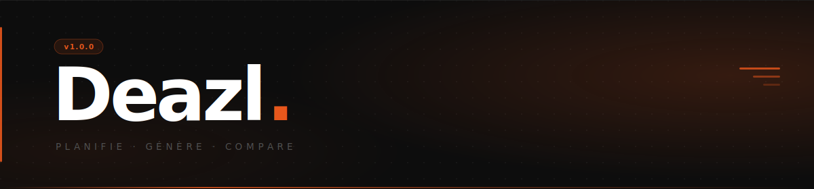

<div align="center">



<br />

[](https://github.com/Clement-Muth/deazl-v2/actions/workflows/ci.yml)
[](https://github.com/Clement-Muth/deazl-v2/releases)
[](https://github.com/Clement-Muth/deazl-v2)
[](https://bun.sh)

</div>

---

## Pourquoi Deazl ?

La planification des repas est une tâche répétitive et mentalement coûteuse. On finit toujours par acheter au même endroit, sans savoir si c'est le meilleur choix — ni en termes de prix, ni de qualité nutritionnelle.

**Deazl automatise tout ça.**

- Planifie ta semaine depuis tes recettes enregistrées
- Génère la liste de courses instantanément
- Compare les prix par ingrédient et par magasin
- Suggère des alternatives meilleures (santé, budget, ou les deux)

---

## Stack

```
Mobile       →  Expo (React Native) · HeroUI Native · Expo Router
Web          →  Next.js 16 · Tailwind CSS v4 · shadcn/ui
Backend      →  Supabase (PostgreSQL · Auth · Storage · Edge Functions)
Monorepo     →  Bun workspaces
i18n         →  Lingui.js
```

---

## Architecture

DDD pragmatique + Vertical Slice. Chaque bounded context est autonome :

```
apps/
├── mobile/                    # App Expo (iOS / Android)
│   └── src/applications/
│       ├── catalog/           # Produits Open Food Facts
│       ├── recipe/            # Recettes & favoris
│       ├── planning/          # Planification hebdomadaire
│       ├── shopping/          # Liste de courses & prix
│       ├── pantry/            # Garde-manger
│       ├── analytics/         # Suivi dépenses
│       └── user/              # Profil & ménage
└── web/                       # Next.js (landing + partage recettes)

supabase/
├── migrations/                # Historique SQL versionné
└── templates/                 # Emails transactionnels
```

Chaque bounded context expose : `domain/` · `application/` · `infrastructure/` · `ui/` · `api/`

---

## Démarrage

**Prérequis :** [Bun](https://bun.sh) `>= 1.0` · [Expo Go](https://expo.dev/go) ou simulateur

```bash
# Cloner et installer
git clone https://github.com/Clement-Muth/deazl-v2.git
cd deazl-v2
bun install
```

**Mobile**

```bash
bun mobile
# Scanner le QR code avec Expo Go
```

**Web**

```bash
bun dev
# http://localhost:3002
```

**Variables d'environnement**

```bash
# apps/web/.env.local
NEXT_PUBLIC_SUPABASE_URL=
NEXT_PUBLIC_SUPABASE_ANON_KEY=

# apps/mobile/.env
EXPO_PUBLIC_SUPABASE_URL=
EXPO_PUBLIC_SUPABASE_ANON_KEY=
```

---

## Workflow Git

| Branche | Rôle | Déploiement |
|---|---|---|
| `staging` | Développement quotidien | Vercel preview |
| `main` | Production (PR only, CI required) | Vercel production |

---

## Versioning

Semver — source de vérité dans `apps/mobile/app.json`, synchronisé dans tous les `package.json`.

→ [Voir les releases](https://github.com/Clement-Muth/deazl-v2/releases)
